# Edge-Case Annotator Agent - Architecture

## 🎯 Overview

System that identifies systematic human annotation errors, generates synthetic edge cases, and produces high-quality evaluation datasets through multi-LLM adversarial debate.

## 🔄 Complete Pipeline Flow


---

## 📊 Phase 1: Data Preparation

### Script 1: `prepare_data.py`


**What it does:**
- Parses guidelines into structured sections
- Adds tags to annotations: `intent`, `entity_type`, `locale`, `device`
- Uses rule-based heuristics from config

### Script 2: `golden_crosscheck.py`


**Key Logic:**
- Joins annotations with goldens by `(query, candidate)` key
- Marks errors: `is_error = true` only when `is_golden AND !is_correct`

---

## 🔍 Phase 2: Build Embedding Indexes

### Script 3: `build_indexes.py`


**Three Indexes Created:**

1. **GUIDELINE_INDEX**: Guidelines split into chunks with embeddings
2. **EXAMPLE_INDEX**: Good examples (correct annotations only)
3. **ALL_ANNOTATIONS_INDEX**: All annotations (for clustering)

**Chunking Types (from config.yaml):**
- Guidelines: 300-600 tokens
- Annotations: max 500 tokens
- Resolved synthetics: max 400 tokens

---

## 🔬 Phase 3: Pattern Discovery

### Script 4: `discover_patterns.py`


**Two-Level Clustering:**
1. **Level 1**: Exact tag matching (fast grouping)
2. **Level 2**: Embedding similarity (find nuanced patterns)

**Budget Allocation Formula:**
```
score_i = quality_gap_i^power × log(base + volume_i)
budget_i = (total_budget × score_i) / Σ(score_j)
```

---

## 🎨 Phase 4: Synthetic Case Generation

### Script 5: `generate_cases.py`


**RAG Context for Generation:**
```
1. Pattern description + seed errors
2. Top 3 most relevant guideline chunks
3. Top 5 similar good examples
```

**LLM #1 Task:**
- Generate NEW queries fitting the error pattern
- Follow locale/intent/entity_type from pattern
- Create realistic query-candidate pairs

---

## ⚔️ Phase 5: Three-LLM Adversarial Debate

### Script 6: `annotate_with_debate.py` (Most Complex)


### RAG Stage 2 - Historical Context


**Key: File persists and grows across runs!**

### Three-LLM Debate Detail


---

## 📦 Phase 6: Build Final Datasets

### Script 7: `build_final_sets.py`


### QA Flow


---

## 🎯 RAG System Architecture

### Two-Stage RAG


**Why Two Stages?**
- **Stage 1**: Learn from original human-annotated data
- **Stage 2**: Maintain consistency with previously resolved synthetics

---

## 📈 Data Flow Summary


### File Sizes (typical)

| File | Phase | Size | Purpose |
|------|-------|------|---------|
| `guidelines.md` | Input | ~50 KB | Annotation rules |
| `goldens.jsonl` | Input | ~100 KB | Golden annotations |
| `annotations.jsonl` | Input | ~500 KB | Human annotations |
| `guideline_index.jsonl` | 2 | ~5 MB | Embedded guidelines |
| `example_index.jsonl` | 2 | ~2 MB | Good examples |
| `all_annotations_index.jsonl` | 2 | ~10 MB | All annotations |
| `edge_case_profiles.jsonl` | 3 | ~50 KB | Discovered patterns |
| `new_cases.jsonl` | 4 | ~200 KB | Generated cases |
| `resolved_synthetics_index.jsonl` | 5 | ~3 MB (grows) | Historical resolved |
| `synthetic_annotations.jsonl` | 5 | ~500 KB | Annotated synthetics |
| `hybrid_set.jsonl` | 6 | ~800 KB | **Final dataset** |

---

## 🔧 Configuration Overview

### Key Parameters (config.yaml)

```yaml
llm:
  generation_temperature: 0.8    # Higher for diversity
  annotation_temperature: 0.3    # Lower for consistency
  judge_temperature: 0.2         # Lowest for stability

rag:
  generation:
    top_k_guidelines: 3
    top_k_examples: 5
  annotation:
    top_k_guidelines: 5
    top_k_examples: 5
    top_k_resolved: 3             # Stage 2

chunking:
  guidelines: 300-600 tokens
  annotations: max 500 tokens
  resolved_synthetics: max 400 tokens

pattern_discovery:
  total_synthetic_budget: 100
  target_quality: 0.95
  clustering_eps: 0.3              # DBSCAN distance threshold

qa:
  judge_accepted_sample_rate: 0.30  # 30% human review
  ambiguous_sample_rate: 1.0        # 100% human review
```

---

## 🚀 Execution Flow

```mermaid
graph TD
    A[python run_all_phases.py] --> B[Load & Validate config.yaml]
    
    B --> C[Phase 1: Data Prep]
    C --> D[Phase 2: Build Indexes]
    D --> E[Phase 3: Pattern Discovery]
    E --> F[Phase 4: Generate Cases]
    F --> G[Phase 5: Annotate with Debate]
    G --> H[Phase 6: Build Final Sets]
    
    H --> I{Success?}
    I -->|Yes| J[✓ HYBRID_SET ready<br/>for evaluation]
    I -->|No| K[Check logs/<br/>edge_case_annotator.log]
    
    G -.->|updates| L[(resolved_synthetics_index)]
    L -.->|next run| G
```



### Command Line Options

```bash
# Run all phases
python run_all_phases.py

# Run specific phase only
python run_all_phases.py --only-phase 3

# Skip a phase
python run_all_phases.py --skip-phase 2

# Start from specific phase
python run_all_phases.py --start-from 4

# Use different config
python run_all_phases.py --config custom_config.yaml
```

---

## 💾 Persistent State

**Files that persist across runs:**

1. **`resolved_synthetics_index.jsonl`** ⭐ Most important
   - Accumulates successfully resolved cases
   - Used in RAG Stage 2
   - Grows with each run
   - Never reset (unless manual deletion)

2. **Configuration:**
   - `config.yaml` (manually edited)

3. **Logs:**
   - `logs/edge_case_annotator.log` (appends)

**Files that are regenerated each run:**
- All Phase 1-4 outputs
- `synthetic_annotations.jsonl` (Phase 5)
- Final datasets (Phase 6)

---

## 🎓 Key Design Decisions

### 1. Why Three LLMs for Annotation?
```
Single LLM → Biased toward one style
Two LLMs → Tie-breaking problem
Three LLMs → Adversarial debate with neutral judge
```

### 2. Why Two-Level Clustering?
```
Embeddings only → Misses exact tag patterns
Tags only → Misses semantic similarity
Both → Finds nuanced patterns within tag groups
```

### 3. Why RAG Stage 2?
```
Without: Each run independent, no learning
With: System learns from previously resolved cases
     Maintains consistency across multiple runs
```

### 4. Why Persistent Index?
```
Transient: Loses knowledge between runs
Persistent: Accumulates expertise over time
           Better RAG context for future cases
```

---

## 📊 Metrics & Quality Control

### Quality Gates


### Final Dataset Quality

```
HUMAN_SET:
  - Quality: 100% (by definition)
  - Coverage: Limited to correct human annotations

SYNTHETIC_SET:
  - Quality: ~85-95% (judge accepted + sample vetted)
  - Coverage: Targeted edge cases

HYBRID_SET: ⭐ Recommended
  - Quality: ~95%+ (only vetted synthetics)
  - Coverage: Human baseline + targeted edge cases
  - Best for evaluation
```

---

## 🐛 Common Issues & Solutions

### Issue 1: No patterns discovered
**Cause:** Not enough errors or too few per tag group  
**Solution:** Adjust `min_pattern_volume` in config.yaml

### Issue 2: All cases marked ambiguous
**Cause:** LLM #4 can't decide due to unclear guidelines  
**Solution:** Review `guideline_index` quality, add more examples

### Issue 3: RAG Stage 2 not helping
**Cause:** `resolved_synthetics_index.jsonl` too small  
**Solution:** Run multiple iterations to build up the index

### Issue 4: Generated cases unrealistic
**Cause:** Temperature too high or poor RAG context  
**Solution:** Lower `generation_temperature` or improve `example_index`

---

## 🔍 Debugging Tips

### Check Intermediate Files

```bash
# See discovered patterns
head edge_case_profiles.jsonl

# See generated cases
head new_cases.jsonl

# See debate results
head synthetic_annotations.jsonl

# Check logs
tail -f logs/edge_case_annotator.log
```

### Validate Data Flow

```bash
# Count records at each stage
wc -l *.jsonl

# Check for empty files
find . -name "*.jsonl" -size 0
```

---

## 📚 Related Documentation

- `README.md` - Quick start guide
- `config.yaml` - All tunable parameters
- `models.py` - Pydantic data models
- `utils.py` - Shared utilities

---

**Last Updated:** November 2024  
**Version:** 1.0

